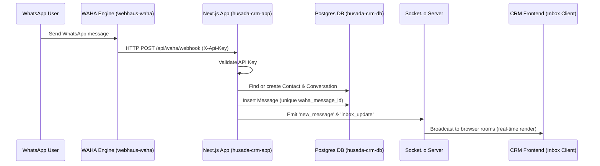

# WAHA Webhook & Inbound Messages Routing

This document details how incoming WhatsApp messages are received, authenticated, processed, and broadcasted to the Husada CRM frontend in real-time.

---

## Architecture Overview



---

## 1. Webhook Endpoint Configuration
The Next.js endpoint that handles incoming events is:
- **Path**: `/api/waha/webhook` (implemented in `src/app/api/waha/webhook/route.ts`)
- **Method**: `POST`
- **Port**: `3000` (internal Docker network)

### Authentication
The endpoint requires an `X-Api-Key` header. The request is rejected with `401 Unauthorized` if this header is missing or does not match the environment variable `WAHA_API_KEY` (fallback: `webhaus-waha-key`).

---

## 2. WAHA Docker Environment Variables
To ensure WAHA automatically registers the webhook target and launches the default session on startup, the following environment variables are configured in the WAHA container (`infra/waha/docker-compose.yml`):

```yaml
services:
  waha:
    environment:
      # Hook Target endpoint inside the shared Docker network
      - WHATSAPP_HOOK_URL=http://husada-crm-app:3000/api/waha/webhook
      
      # Event subscriptions
      - WHATSAPP_HOOK_EVENTS=message,message.ack
      
      # API Key authentication header
      - WHATSAPP_HOOK_CUSTOM_HEADERS=X-Api-Key:webhaus-waha-key
      
      # Auto-start default session upon container launch
      - WHATSAPP_START_SESSION=default
```

---

## 3. Webhook Event Processing Flow

When a `message` event payload is received:
1. **LID Resolution**: If the sender number is a WhatsApp LID (e.g. `...text@lid`), the handler calls WAHA's `/api/default/lids/{lid}` endpoint to resolve it to the standard phone number (MSISDN).
2. **Contact Creation**: Queries the database for the resolved contact number. If it is a new contact, it is created and assigned to the default Stage.
3. **Conversation Placement**: Places the message in the contact's active `OPEN` conversation. A new one is opened if none exists.
4. **Message Insert**: Inserts the message with direction `INBOUND` and its original WAHA ID (`waha_message_id` has a unique constraint to prevent duplicate ingestion).
5. **Real-time Broadcast**: If successful, Socket.io emits:
   - `new_message` to the specific conversation room `conversation:{conversationId}`.
   - `inbox_update` globally to notify the dashboard sidebar and update chat listings.

---

## 4. AI Chatbot Onboarding Flow
The webhook handler integrates an automated AI Chatbot onboarding flow for new contacts before they are handed off to human agents.

### Chatbot States & Flow:
1. **Initial (State: `null`)**: Sent greeting message and asks for the contact's name. Transitions to `ask_name`.
2. **Name Collection (State: `ask_name`)**: Receives contact's reply, updates contact's name, asks for their domicile. Transitions to `ask_domicile`.
3. **Domicile Collection (State: `ask_domicile`)**: Receives contact's reply, updates contact's domicile, list active products, and asks for their chief complaint or product interest. Transitions to `ask_complaint`.
4. **Complaint Collection (State: `ask_complaint`)**: Receives complaint/question, attempts to map choice to active `Product` ID, sets `chatbotState` to `done`, clears temporary `chatbotData`, sends confirmation, and hands off the conversation to human agents.

---

## 5. Manual Verification & Testing

### Test A: Mock Inbound Webhook Request
You can test the webhook processing pipeline on the VPS by sending a mock webhook request using the following cURL command from the host:

```bash
docker exec -i webhaus-waha curl -i -X POST \
  -H "X-Api-Key: webhaus-waha-key" \
  -H "Content-Type: application/json" \
  -d '{"event":"message","payload":{"id":"mock_msg_unique_id","from":"62812345678@c.us","body":"Halo, tes pesan masuk!","fromMe":false,"timestamp":1717514100}}' \
  http://husada-crm-app:3000/api/waha/webhook
```

### Test B: Database Query
To check the latest received messages directly in the PostgreSQL database container:

```bash
docker exec -it husada-crm-db psql -U postgres -d husadacrm -c "SELECT content, sent_at, direction FROM messages ORDER BY sent_at DESC LIMIT 5;"
```
